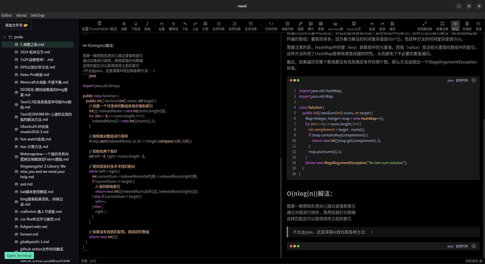
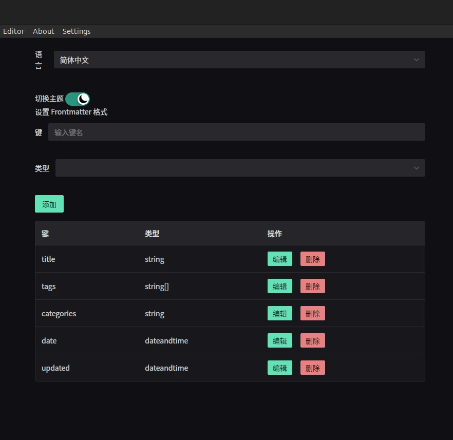
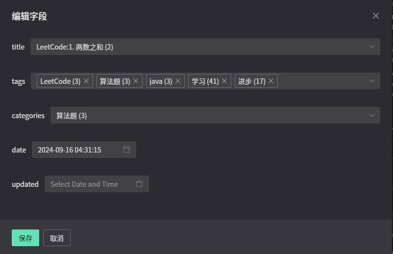

[繁体中文](./README_zh-TW.md) | [English](./README_en.md)
# Rsoul - 一个专注于frontmatter的md编辑器

> 使用前需要先配置Frontmatter

## 简介

Rsoul是一个专注于frontmatter的markdown编辑器，可以自定义frontmatter字段。

## 自定义部分

## 重点：方便编辑Frontmatter

自动补全类似于tags,category等常用字段，遍历选中的文件夹下的md的frontmatter字段，在填写的时候提示补全

## 致谢

### 前端依赖致谢

Rsoul 的前端构建离不开以下优秀开源项目的支持：

- **Tauri**: 提供了跨平台桌面应用框架，使 Rsoul 能够在 Windows、macOS 和 Linux 上运行。
- **Naive UI**: 一个现代化的 Vue 3 UI 组件库，为 Rsoul 提供了美观且易用的界面组件。
- **md-editor-v3**: 强大的 Markdown 编辑器组件，支持实时预览和丰富的工具栏功能。
- **Vue 3**: 现代化的前端框架，为 Rsoul 的响应式界面提供了坚实基础。
- **front-matter**: 用于解析和生成 YAML frontmatter 的库，简化了 Markdown 文件的元数据处理。
- **Vue I18n**: 提供了多语言支持，使 Rsoul 能够支持中文和英文界面。
- **其他依赖**: 包括 @tauri-apps/api、@vicons/ionicons5 等，为 Rsoul 的功能实现提供了关键支持。

### 后端依赖致谢

Rsoul 的后端（Rust）依赖以下库：

- **Tauri**: 核心框架，连接前端和系统 API。
- **Serde**: 强大的序列化/反序列化库，用于 JSON 和 YAML 数据处理。
- **Walkdir**: 递归目录遍历库，用于扫描 Markdown 文件。
- **Tauri Plugins**: 包括 tauri-plugin-fs、tauri-plugin-dialog 等，为文件系统操作和对话框提供了便利。

### 特别致谢

- **GitHub Copilot**: 在 Rust 代码编写过程中提供了极大的帮助，尤其是在错误处理、异步编程和 API 调用方面，加速了开发进程。感谢 Copilot 的智能建议和代码生成能力。