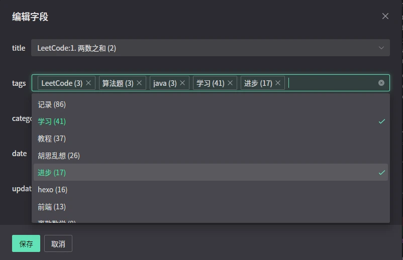

[Simplified Chinese](./README.md) | [Traditional Chinese](./README_zh-TW.md)
# Rsoul - A Markdown Editor Focused on Frontmatter

> Configure Frontmatter before use

## Introduction

Rsoul is a Markdown editor focused on frontmatter, allowing customization of frontmatter fields.

## Customization Section

## Key Feature: Convenient Frontmatter Editing

Auto-completion for common fields like tags, category, etc. It scans the frontmatter fields of all Markdown files in the selected folder and provides suggestions during editing.

## Acknowledgments

### Frontend Dependencies Acknowledgments

Rsoul's frontend is built with the support of the following excellent open-source projects:

- **Tauri**: Provides a cross-platform desktop application framework, enabling Rsoul to run on Windows, macOS, and Linux. Special thanks to the Tauri team for their outstanding work.
- **Naive UI**: A modern Vue 3 UI component library, providing Rsoul with beautiful and user-friendly interface components.
- **md-editor-v3**: A powerful Markdown editor component, supporting real-time preview and rich toolbar features.
- **Vue 3**: A modern frontend framework, providing a solid foundation for Rsoul's reactive interface.
- **front-matter**: A library for parsing and generating YAML frontmatter, simplifying metadata handling in Markdown files.
- **Vue I18n**: Provides internationalization support, enabling Rsoul to support Chinese and English interfaces.
- **Other Dependencies**: Including @tauri-apps/api, @vicons/ionicons5, etc., providing key support for Rsoul's functionality.

### Backend Dependencies Acknowledgments

Rsoul's backend (Rust) relies on the following libraries:

- **Tauri**: Core framework, connecting the frontend and system APIs.
- **Serde**: A powerful serialization/deserialization library for JSON and YAML data processing.
- **Walkdir**: A recursive directory traversal library for scanning Markdown files.
- **Tauri Plugins**: Including tauri-plugin-fs, tauri-plugin-dialog, etc., providing convenience for file system operations and dialogs.

### Special Acknowledgments

- **GitHub Copilot**: Provided tremendous help in Rust code writing, especially in error handling, asynchronous programming, and API calls, accelerating the development process. Thanks to Copilot's intelligent suggestions and code generation capabilities.
- **Open Source Community**: Thanks to all open-source contributors; without their work, the Rsoul project would not be possible.