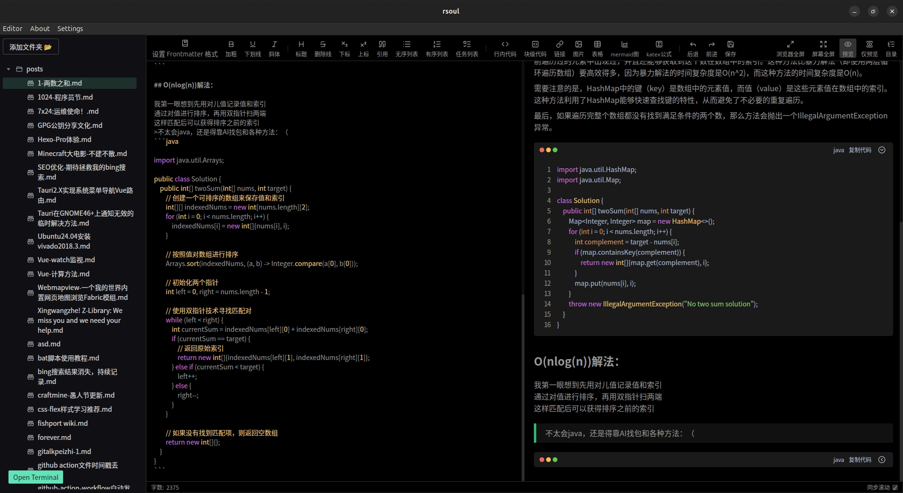

[簡體中文](./README.md) | [English](./README_en.md)
# Rsoul - 一個專注於frontmatter的md編輯器

> 使用前需要先配置Frontmatter

## 簡介

Rsoul是一個專注於frontmatter的markdown編輯器，可以自定義frontmatter欄位。

## 自定義部分

## 重點：方便編輯Frontmatter

自動補全類似於tags,category等常用欄位，遍歷選中的資料夾下的md的frontmatter欄位，在填寫的時候提示補全

## 致謝

### 前端依賴致謝

Rsoul 的前端建構離不開以下優秀開源項目的支持：

- **Tauri**: 提供了跨平台桌面應用框架，使 Rsoul 能夠在 Windows、macOS 和 Linux 上運行。特別感謝 Tauri 團隊的卓越工作。
- **Naive UI**: 一個現代化的 Vue 3 UI 組件庫，為 Rsoul 提供了美觀且易用的介面組件。
- **md-editor-v3**: 強大的 Markdown 編輯器組件，支持即時預覽和豐富的工具欄功能。
- **Vue 3**: 現代化的前端框架，為 Rsoul 的響應式介面提供了堅實基礎。
- **front-matter**: 用於解析和生成 YAML frontmatter 的庫，簡化了 Markdown 文件的元資料處理。
- **Vue I18n**: 提供了多語言支持，使 Rsoul 能夠支持中文和英文介面。
- **其他依賴**: 包括 @tauri-apps/api、@vicons/ionicons5 等，為 Rsoul 的功能實現提供了關鍵支持。

### 後端依賴致謝

Rsoul 的後端（Rust）依賴以下庫：

- **Tauri**: 核心框架，連接前端和系統 API。
- **Serde**: 強大的序列化/反序列化庫，用於 JSON 和 YAML 資料處理。
- **Walkdir**: 遞歸目錄遍歷庫，用於掃描 Markdown 文件。
- **Tauri Plugins**: 包括 tauri-plugin-fs、tauri-plugin-dialog 等，為檔案系統操作和對話框提供了便利。

### 特別致謝

- **GitHub Copilot**: 在 Rust 程式碼編寫過程中提供了極大的幫助，尤其是在錯誤處理、異步程式設計和 API 調用方面，加速了開發進程。感謝 Copilot 的智慧建議和程式碼生成能力。
- **開源社群**: 感謝所有開源貢獻者，沒有他們的工作，Rsoul 項目無法實現。